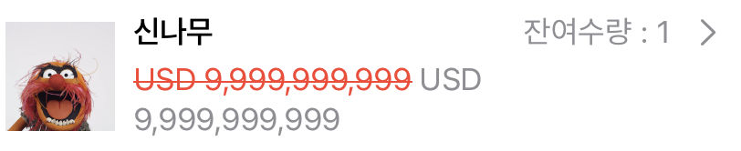
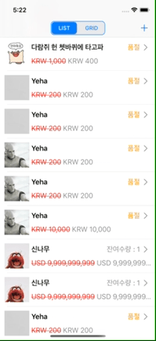
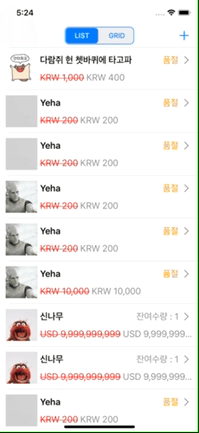
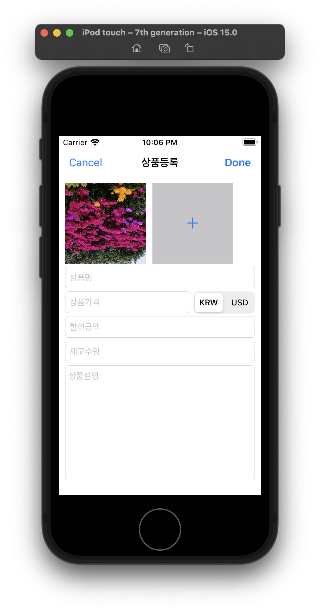
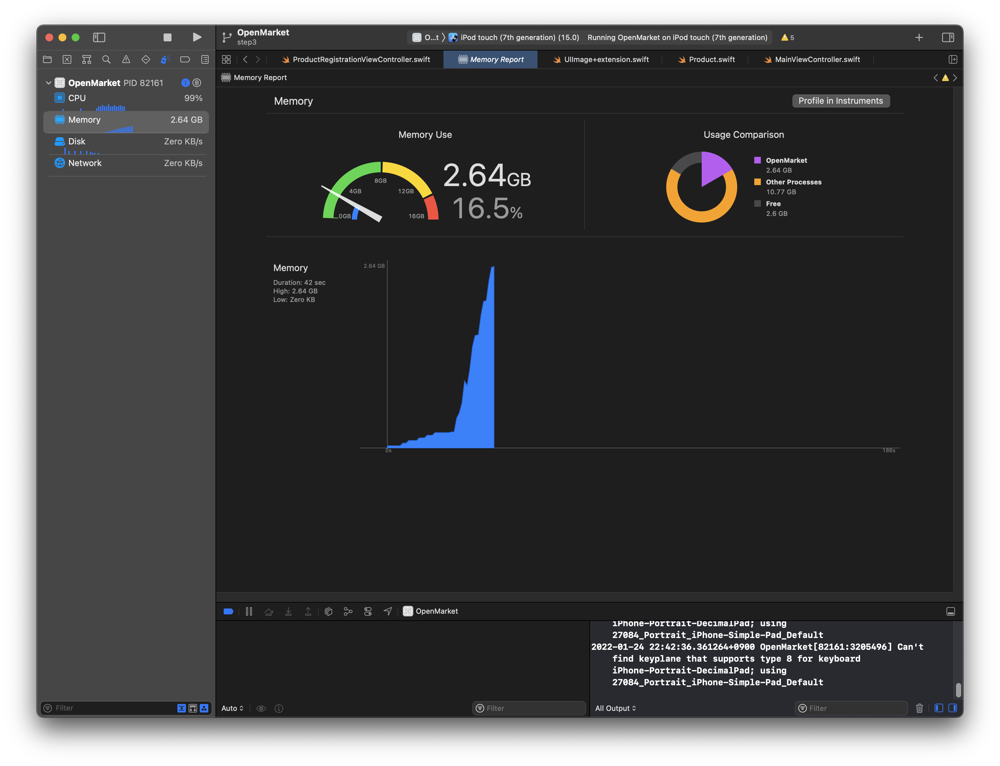

# 오픈마켓 프로젝트

네트워크 통신을 통해 상품을 콜렉션뷰, 테이블뷰로 보여주고 등록, 수정, 삭제할 수 있는 프로젝트입니다. 

### 프로젝트 구현 예시

| 메인                                                                  | 등록                                                  | 수정                                                | 삭제                                                |
| ------------------------------------------------------------------- | --------------------------------------------------- | ------------------------------------------------- | ------------------------------------------------- |
|  |  |  |  |

# STEP 1

## 🤔 고민했던 점

### 1. 줄바꿈 규칙

```swift
// 처음 규칙
private static func buildBody(with salesInformation: SalesInformation,
                              images: [String: Data]) -> Data? {
```

```swift
// 변경된 규칙
private static func buildBody(
    with salesInformation: SalesInformation,
    images: [String: Data]
) -> Data? {
```

Parameter가 길어서 이전 줄바꿈 규칙으로 문제가 있었습니다.
줄바꿈 규칙을 [Swift Style Guide](https://github.com/StyleShare/swift-style-guide#%EC%A4%84%EB%B0%94%EA%BF%88) 를 따르도록 변경했습니다.

### 2. 구조체의 프로퍼티에 let를 사용

`var`로 선언한 경우 인스턴스를 생성할 때 let으로 선언해주면 내부 프로퍼티도 전부 let으로 변경이 불가능하고, var로 선언해주면 내부 프로퍼티를 수정할 수 있다고 알고 있었습니다.

따라서 처음에는 let으로 선언해주는 것보다 코드를 유동적으로 사용할 수 있다고 판단했고 var로 프로퍼티들을 정의했습니다.

하지만 아래와 같은 이유로 let이 더 낫다고 판단했고, let으로 선언했습니다. 

> 네 경우에 따라서 구조체 인스턴스 값을 직접 변경해야하는 경우도 필요합니다. 다만 네트워크 매핑 모델의 같은 경우는 `let`으로 불변성을 유지하는게 좀 더 바람직한 접근법 같아요. 이렇게 원천 데이터에 변경을 직접 가하는건 예상치 못한 사이드 이펙트를 발생시키는 경우도 있거든요. 그래서 저는 보통

원격 저장소 데이터 매핑 모델 - 비즈니스 로직 수행을 위한 모델 - 화면에 그려주는데 필요한 모델

이렇게 모델도 계층을 나누어 관리합니다. 한 계층에서의 변경의 여파가 외부로 퍼저나가지 않도록 하기 위해 말이죠

> 

### 3. Snake-Case와 Date를 변환하는 방법

Mock 데이터와 서버에서 받아야 하는 데이터 모두 SnakeCase로 작성되어 있었습니다. 또한 Date의 경우도 Mock 데이터에서 String으로 되어 있어 변환하는 방법에 대해 고민했습니다.
처음에는 따로 `init(from decoder: Decoder)`을 만들어 바꿔주는 방식을 택했습니다.

```swift
init(from decoder: Decoder) throws {
    let container = try decoder.container(keyedBy: Self.CodingKeys)
    id = try container.decode(Int.self, forKey: .id)
    vendorId = try container.decode(Int.self, forKey: .vendorId)
    name = try container.decode(String.self, forKey: .name)
    thumbnail = try container.decode(String.self, forKey: .thumbnail)
    currency = try container.decode(Currency.self, forKey: .currency)
    price = try container.decode(Int.self, forKey: .price)
    bargainPrice = try container.decode(Int.self, forKey: .bargainPrice)
    discountedPrice = try container.decode(Int.self, forKey: .discountedPrice)
    stock = try container.decode(Int.self, forKey: .stock)

    let createdAt = try container.decode(String.self, forKey: .createdAt)
    let issuedAt = try container.decode(String.self, forKey: .issuedAt)

    let formatter = DateFormatter()
    formatter.dateFormat = "yyyy-MM-dd HH:mm:ss.SSS"guard let formattedCreatedAt = formatter.date(from: createdAt),
          let formattedIssuedAt = formatter.date(from: issuedAt) else {
              throw FormattingError.dateFormattingFail
          }
     self.issuedAt = formattedIssuedAt
     self.createdAt = formattedCreatedAt
}
```

하지만 이후 `dateDecodingStrategy`와 `keyDecodingStrategy` 중 `convertFromSnakeCase`이 있는 것을 알았고 위 방법이 아닌 Decoding Strategy를 사용하는 방법을 선택했습니다.

### 4. URLSession.dataTask(with:) `URLRequest` 타입만 사용

```swift
let dataTask = URLSession.shared.dataTask(with: request) { data, response, error in
    if let error = error {
        completionHandler(.failure(error))
        return
    }
    guard let httpResponse = response as? HTTPURLResponse,
          (200...299).contains(httpResponse.statusCode) else {
              completionHandler(.failure(NetworkError.httpError))
              return
          }
    guard let data = data else { return }
    completionHandler(.success(data))
}
```

위 코드가 `NetworkTask`에서 반복적으로 사용되었음에도 URL을 사용하는 부분과 URLRequest를 사용하는 부분으로 나눠져 있어 함수로 분리하는데 어려움이 있었습니다.
처음에는 저희가 만든 `dataTask` 메서드에서 with request 매개변수에 제네릭을 사용하려고 했으나 이렇게 할 경우 `URLSession.shared.dataTask(with: request)`에서 문제가 발생했습니다.

> No exact matches in call to instance method 'dataTask’

따라서 여기선 항상 `URLRequest`를 받도록 구현했고, URL을 사용하는 경우 다음과 같이 `URLRequest`로 변환하는 과정을 추가해주었습니다.`var request = URLRequest(url: url)`

### 5. `URLSession.dataTask(with:completionHandler:)` 에서 error와 response를 처리하는 방법

```swift
enum NetworkResponse {
    case response(URLResponse, Data?)
    case error(Error)
}
```

`Result<Data, Error>` 타입 대신 위의 `NetworkResponse` 타입을 사용할지 고민했습니다.
지금은 http status code를 따로 처리할 필요가 없을듯 해서 Result 타입을 사용했습니다.

### 6. `multipart/form-data` 를 위한 body 만들기

다른 곳에선 `application/json`을 사용해서 문제가 없었으나 상품 등록에선 `multipart/form-data`을 사용해야 해서 이를 위한 body를 구현해줘야 하는 문제가 있었습니다.
따라서 따로 `buildBody`라는 메서드를 만들어 `multipart/form-data`에 맞는 body를 만들어줄 수 있도록 구현했습니다.

`multipart/form-data`의 body를 만들기 위해 지켜야 할 점

1. 바운더리를 구분하기 위한 문자열을 임의로 정한다.
   → 저희의 경우 UUID().uuidString을 통해 임의의 문자열을 생성해주었습니다.
2. 각 폼 필드 요소의 값은 `--바운더리` 모양의 라인 하나로 구분된다.
3. 이후 해당 필드 요소 데이터에 대한 헤더를 정의한다.
   → ex: `"Content-Disposition: form-data; name=\"params\"\r\n\r\n"`
4. 헤더와 내용에는 반드시 빈 줄 1개가 있어야 한다.
5. 모든 요소의 기입이 끝났으면 줄을 바꾸고 `--바운더리--`의 모양으로 데이터를 기록하고 끝낸다.

### 7. 의존성 주입을 통한 객체 간 강결합 해소

기존에는 `NetworkTask`에서 `JSONParser`를 사용할 때 `static`을 사용하여 접근할 수 있도록 했습니다. 하지만 이렇게 사용할 경우 JSONParser를 전역에서 사용할 수 있기 때문에 싱글톤 사용 시 발생하는 “Sacrificing Transparency for Convenience” 문제가 발생했습니다. 

따라서 `JSONParser`를 프로토콜로 추상화한 뒤 `NetworkTask`의 인스턴스를 생성할 때 의존성 주입으로 `JSONParser`를 사용할 수 있도록 수정했습니다.

```swift
struct NetworkTask {
    let jsonParser: JSONParsable
}

protocol JSONParsable {
    func decode<Element: Decodable>(from data: Data) throws -> Element
    func encode<Element: Encodable>(from element: Element) throws -> Data
}
```

# STEP 2

## 🤔 고민했던 점

### 1. 썸네일 다운로드를 비동기로 변경했습니다.

스크롤 속도가 느려지는 문제가 있었습니다.
썸네일 다운로드를 비동기로 변경했습니다.

```swift
// sync
let image = UIImage(data: imageData)
cell.productImageView.image = image
```

```swift
// async
cell.productImageView.image = nil
networkTask.downloadImage(from: url) { result in
    guard let image = UIImage(data: data) else { return }
    DispatchQueue.main.async {
        guard indexPath == tableView.indexPath(for: cell) else { return }
        cell.productImageView.image = image
    }
}
```

| sync                                                    | async                                                     |
| ------------------------------------------------------- | --------------------------------------------------------- |
|  |  |

### 2. SwiftLint 사용

코드 컨벤션을 보다 명확하게 준수하기 위해 SwiftLint를 사용했습니다. 

처음에는 CocoaPod을 활용해 SwiftLint를 프로젝트에 적용시켜줬으나, 이미 `.swiftlint.yml` 파일을 통해 컨벤션을 정해주었고 버전 관리까지 해줄 필요는 없다고 판단하여 homebrew를 통해 직접 설치를 해주었습니다. 

특히 코코아팟을 사용할 경우 불필요하게 생기는 파일도 많았는데, 버전 관리를 해줄 필요가 없다면 코코아팟을 굳이 사용할 이유는 없다고 판단하여 코코아팟으로 설치한 SwiftLint는 제거해주었습니다. 

### 3. NSAttributedString 사용

단순히 label.text로 할 경우 String으로 값을 주게 되는데 이 경우 font나 color를 지정해주려면 label에 직접 적용해줘야 했습니다. label에 직접 적용을 할 경우 CollectionView와 TableView에 중복되는 코드를 반복해서 적어줘야 하는 단점이 존재했습니다. 

따라서 label.attributeText에 레이블을 넣어주고 `Product`에서 직접 연산 프로퍼티를 통해 `attributedTitle`, `attributedPrice`, `attributedStock`를 생성해주었습니다. 또한 여기서 직접 color와 font, strikethroughStyle을 적용시켜줄 수 있도록 했습니다. 

### 4. extension UIViewController

`ProductsCollectionViewController`, `ProductsTableViewController`에서 중복되는 코드를 `UIViewController`의 extension 함수 하나로 분리했습니다.

```swift
case .failure(let error):
    self.showAlert(
        title: "Network error",
        message: "데이터를 불러오지 못했습니다.\n\(error.localizedDescription)"
    )
    self.loadingActivityIndicator.stopAnimating()
}

extension UIViewController {
    func showAlert(title: String?, message: String?) {
        let alert = UIAlertController(
            title: title,
            message: message,
            preferredStyle: .alert
        )
        let okAction = UIAlertAction(title: "OK", style: .default, handler: nil)
        alert.addAction(okAction)
        DispatchQueue.main.async {
            self.present(alert, animated: true, completion: nil)
        }
    }
}
```

### 5. extension Data

NetworkTask.buildBody(from:images:)의 가독성을 높이기 위한 것입니다.

```swift
// 변경전
var data = Data()
var paramsBody = ""
paramsBody.append("--\(boundary)\r\n")
paramsBody.append("Content-Disposition: form-data; name=\"params\"\r\n\r\n")
guard let paramsBody = paramsBody.data(using: .utf8) else {
    return nil
}
data.append(paramsBody)
```

```swift
// 변경후
var data = Data()
data.append("--\(boundary)\r\n")
data.append("Content-Disposition: form-data; name=\"params\"\r\n\r\n")

private extension Data {
    mutating func append(_ string: String) {
        guard let data = string.data(using: .utf8) else { return }
        self.append(data)
    }
}
```

### 6. 스토리보드 파일 분리

협업시 충돌 방지를 위해서 스토리보드 파일을 분리했습니다.

### 7. 통화 줄바꿈 문제 해결

통화 이름과 숫자 사이의 공백이 줄바꿈 되지 않도록 수정했습니다.
`" "` 대신 `"\u{A0}"` 를 사용합니다.

| 전                                        | 후                                       |
| ---------------------------------------- | --------------------------------------- |
|  |  |

### 8. 컬렉션 뷰 가로화면에서 셀 크기 개선

가로로 디바이스를 돌릴 경우 컬렉션 뷰의 셀 크기가 너무 커지는 문제가 있었습니다. 

따라서 frameWidth가 frameHeight보다 작은 경우(세로인 경우)는 기존대로 frameWidth를 기준으로 Cell의 너비를 정해줬으나, 가로로 돌렸을 때에는 frameHeight을 기준으로 Cell의 너비를 정할 수 있도록 구현했습니다. 

```swift
let frameWidth = collectionView.frameLayoutGuide.layoutFrame.width
let frameHeight = collectionView.frameLayoutGuide.layoutFrame.height
let shortLength = frameWidth < frameHeight ? frameWidth : frameHeight
let cellWidth = shortLength / 2 - 15
return CGSize(width: cellWidth, height: cellWidth * 1.5)
```

### 9. Pagination 구현

기존에는 1페이지의 아이템 20개만 로드되는 문제가 있었습니다. 

페이지를 넘기면 새로운 데이터가 로드될 수 있도록 `collectionView(_:willDisplay:forItemAt:)` 메서드를 사용하여 indexPath의 item이 전체 products의 개수와 같은 경우 새로운 페이지를 로드하고 pageNumber를 1 추가할 수 있도록 구현했습니다. 

tableView의 경우도 동일한 매개변수를 가진 메서드를 사용해 문제를 해결했습니다. 

## 💡 새롭게 알게 된 점

### 1. 셀의 높이가 변하지 않음

레이아웃의 제약끼리 충돌이 있어서 셀의 크기가 늘어나지 않는 문제가 있었습니다.

이유는 테이블뷰 셀의 이미지뷰가 스택뷰안에 들어가있고, 이 안에서 너비를 60을 유지하며 높이는 이와 동일하게 가져가려하기 때문이었습니다.

이미지뷰를 스택뷰 밖으로 빼서 해결했습니다.

### 2. 의존성 주입을 통한 JSONParser 및 NetworkTask 전달

기존에는 CollectionView와 TableView에 직접 jsonParser 및 networkTask의 인스턴스를 생성하여 이를 사용했습니다. 

하지만 이 경우 `instantiateViewController(identifier:creator:)`메서드를 사용하여 의존성 주입을 할 수 있도록 구현했습니다. 

하지만 이는 추후 TableViewController와 CollectionViewController가 유연성과 변동성이 일반 ViewController에 비해 떨어진다고 판단하여 현재 관련 코드는 삭제한 상황입니다. 

## ❓ 아직 해결하지 못한 점

### 1. iOS 13, 14 시뮬레이터에서 컬렉션 뷰 이미지 다운로드가 이상함

| 비정상                               | 정상                               |
| --------------------------------- | -------------------------------- |
|  |  |

iOS 15에선 CollectionView, TableView 모두 이미지를 잘 받아왔습니다. 하지만 ios13.0, 13.2, 14.0 시뮬레이터로 테스트를 했을 때에는 컬렉션 뷰만 이미지 일부가 다운로드되지 않는 문제가 있었습니다. 

테이블 뷰에선 버전 차이 없이 이미지 다운로드가 원활히 됐는데, 컬렉션 뷰에서만 이미지 다운로드가 잘 되지 않아 이유를 고민해보았지만 원인을 찾을 수 없었습니다.

# STEP 3

## 🤔 고민했던 점

### 1. Dismiss interactively를 사용

기존에는 스토리보드의 attribute Inspector에서 keyboard 설정을 `Dismiss on drag`로 했습니다. 하지만 드래그를 할 때마다 키보드를 닫을 필요는 없다고 판단했고 키보드를 닫을 수 있는 액션은 필요하다고 판단하여 `Dismiss interactively`를 사용했습니다.

키보드를 닫을 수 있는 액션에 `TextView`나 `TextField`가 아닌 다른 곳을 터치하면 `Tap gesture recognizer`를 통해 키보드를 닫을 수 있도록 구현은 해놓았으나 이는 사용자가 알 수 없을 수도 있겠다고 판단하여 `Dismiss interactively`를 사용하는 것이 적합하다고 판단했습니다.

### 2. 키보드가 컨텐츠를 가리지 않을 것

키보드가 컨텐츠를 가리지 않도록 하는 방법에 대해 고민했습니다.
처음에는 아래처럼 view.frame의 origin을 직접 변경하는 방식을 선택했습니다.

```swift
@objc private func keyboardWillShow(_ sender: Notification) {
    if let keyboardFrame = sender.userInfo?[UIResponder.keyboardFrameEndUserInfoKey] as? NSValue {
        let keyboardRectangle = keyboardFrame.cgRectValue
        let keyboardHeight = keyboardRectangle.height
        view.frame.origin.y = -keyboardHeight
    }
}

@objc private func keyboardWillHide(_ sender: Notification) {
    view.frame.origin.y = 0
}
```

하지만 이렇게 했을 때 화면 자체가 올라가면서 위에 있는 내용을 볼 수 없는 문제가 발생했습니다.
따라서 화면 자체를 위로 올리는 것이 아닌 스크롤 뷰의 contentInset을 키보드의 높이만큼 늘리는 방법을 선택했습니다.

`scrollView.contentInset.bottom = keyboardHeight`

이런 식으로 scrollView의 하단 contentInset을 키보드만큼 주어 위에 있는 내용도 확인할 수 있으면서 컨텐츠도 가리지 않도록 구현했습니다.

### 3. 실시간 입력값 유효성 검증

> Dynamically validate field values.
> It’s frustrating when you have to go back and correct mistakes after 
> filling out a lengthy form. Whenever possible, check field values 
> immediately after entry so users can correct them right away.

> 사용자가 입력한 정보를 잘못 입력했을 때 텍스트 필드에 인라인으로 오류 메시지를 나타낸다. 이때 오류 메시지는 레이블과 구분되는 디자인을 권장한다.https://brunch.co.kr/@chulhochoiucj0/20

![README_IMAGES/150791333-e7a7cdf7-3c88-422c-954f-8f24590b675b.png]

![README_IMAGES/150813149-8d6a019f-9a2c-4f01-a6b1-0483e29767a3.mp4]

HIG 문서에서 TextField를 통해 받은 데이터의 유효성을 실시간으로 검증하라는 내용이 있었습니다.
 따라서 기존에는 Done 버튼을 누를 때만 상품 등록 내용이 적합하게 작성되었는지 검증했지만, textField의 내용을 수정할
 때마다 유효성을 검증해야겠다고 판단했습니다.

디자인의 경우 레이블의 경우 이미 PlaceHolder를 통해 보여주고 있었기 때문에 오류 메세지는 TextField의 상단에 표시되도록 구현했습니다.

`.addTarget(self, action: #selector(textInputDidChange(_:)), for: .editingChanged)`

실시간으로 값을 점검하기 위해 위 코드를 사용하여 수정될 때마다 `textInputDidChange(_:)` 메서드가 호출될 수 있도록 했습니다.

다만 TextView의 경우 addTarget 메서드가 존재하지 않아 TextView만 `UITextViewDelegate`의 메서드인 `textViewDidEndEditing` 를 호출해 사용했습니다. 해당 메서드의 경우 실시간이 아닌 TextView의 수정이 끝났을 때만 호출되는 문제가 있었는데 이는 아직 해결하지 못했습니다.

### 4. 숫자 입력을 위한 필드의 입력값 검증

가격과 재고 텍스트 필드에는 양수만 입력 가능하도록 했습니다.

```swift
extension ProductRegistrationViewController: UITextFieldDelegate {
    func textField(
        _ textField: UITextField,
        shouldChangeCharactersIn range: NSRange,
        replacementString string: String
    ) -> Bool {
        if productPriceTextField.isFirstResponder ||
            discountedPriceTextField.isFirstResponder ||
            stockTextField.isFirstResponder {
            if string.isEmpty {
                return true
            }
            let numberCharacterSet = CharacterSet.decimalDigits
            let inputCharacterSet = CharacterSet(charactersIn: string)
            let isValid = numberCharacterSet.isSuperset(of: inputCharacterSet)
            return isValid
        }
        return true
    }
}
```

### 5. 이미지를 크롭 및 리사이즈

명세에서 이미지가 정사각형으로 크롭이 되어 들어가있었고, 이미지의 용량도 300KB 미만으로 넣어야 했기 때문에 이미지를 크롭하고 리사이즈하는 방법에 대해 고민했습니다.

이미지 크롭의 경우 가로 세로 길이를 비교하여 짧은 쪽을 기준으로 크롭을 하는 방식을 선택했습니다.

```swift
func cropSquare() -> UIImage? {
    let imageSize = self.size
    let shortLength = imageSize.width < imageSize.height ? imageSize.width : imageSize.height
    let origin = CGPoint(
        x: imageSize.width / 2 - shortLength / 2,
        y: imageSize.height / 2 - shortLength / 2
    )
    let size = CGSize(width: shortLength, height: shortLength)
    let square = CGRect(origin: origin, size: size)
    guard let squareImage = self.cgImage?.cropping(to: square) else {
        return nil
    }
    return UIImage(cgImage: squareImage)
}
```

또한 이 조건의 경우 이미지 선택이 완료되었을 때 이뤄져야 하기 때문에 **imagePickerController(_:didFinishPickingMediaWithInfo:)** 메서드에서 조건을 추가해줬습니다.

![README_IMAGES/150791141-b002649c-c0ee-4abb-9478-c74357913df9.png]

origin의 경우 가운데로 크롭이 될 수 있도록 그림처럼 origin을 이동시켜줬습니다.

### 6. 꽃 사진만 자동으로 180도 회전이 되는 문제

UIImage 크롭 후에 생기는 문제입니다.
시뮬레이터에 미리 준비된 사진 중에서 꽃 사진이 뒤집혀서 나옵니다.

`UIImage(cgImage: squareImage)` 대신 아래 코드를 사용해서 해결했습니다.

```swift
UIImage(cgImage: squareImage, scale: 1.0, orientation: self.imageOrientation)
```



### 7. 이미지 피커에서 더블 클릭을 하는 경우 이미지가 2개 올라가는 문제

이미지 피커가 닫히지 전에 두번 누르면, 2개 올라갑니다.

이때 두번째 선택을 무시하기 위한 코드입니다.

```swift
guard picker.isBeingDismissed == false,
      var newImage = info[.originalImage] as? UIImage else {
          picker.dismiss(animated: true, completion: nil)
          return
      }
```

위 코드를 통해 dismiss가 되지 않을 때만 이미지를 등록할 수 있도록 구현했습니다. 

### 8. TextView의 수정을 실시간으로 알 수 있는 방법

이전 코드에서 TextView는 입력이 끝나야 유효성을 검증합니다.
유저가 위의 텍스트 필드부터 입력했다면, 상품설명을 쓰던 유저가 텍스트 필드처럼 입력중에 검증될 것이라 예상할 것입니다. 그래서 이 상황은 혼란스러울 것입니다.

```swift
extension ProductRegistrationViewController: UITextViewDelegate {
    func textViewDidEndEditing(_ textView: UITextView) {
        textInputDidChange(textView)
    }
}
```

따라서 이를 해결하기 위해 Delegate 메서드로 해결했습니다.

```swift
extension ProductRegistrationViewController: UITextViewDelegate {
    func textView(_ textView: UITextView, shouldChangeTextIn range: NSRange, replacementText text: String) -> Bool {
        if let count = textView.text?.count {
            let textLength = count - range.length + text.count
            textInputDidChange(textView, textLength: textLength)
        }
        return true
    }
}
```

## 해결하지 못한 부분

### 1. iOS 14.0에서 자동으로 컬렉션뷰에 배경색이 설정되는 문제

iOS 15.0에서는 문제가 없었지만 iOS 14.0에선 segmented Controll을 통해 컬렉션뷰로 이동할 때 검은 색으로 배경이 바뀌는 문제가 있었습니다. 

물론 아래 코드를 추가하여 문제를 해결하긴 했습니다.

`collectionView.backgroundColor = .systemBackground`

다만 아직 왜 이런 현상이 일어나는지는 찾지 못했습니다...🥲

[151150071-36068f59-1e77-45bf-9fb2-490b434bad3c](README_IMAGES/151150071-36068f59-1e77-45bf-9fb2-490b434bad3c.mp4)

### 2. 이미지 리사이즈에 메모리가 많이 필요한 문제

아래는 기본 꽃 사진을 5장 업로드할 때입니다. 메모리가 엄청나게 많이 듭니다. 리사이즈 횟수가 더 많은 코드에서는 7GB를 쓸 때도 있었습니다.
swift는 ARC를 사용하므로 가비지 컬렉터와 달리 필요없는 인스턴스가 즉시 해제될 것인데, 어디서 메모리를 이렇게 쓰는 건지는 정확히 파악하지 못했습니다. 

또한 iPod touch (7th generation)으로 실행을 했을 때와 iPhone으로 실행했을 때 사용하는 메모리의 양이 달랐는데 그 이유도 파악하진 못했습니다. 



# STEP 4

## 🤔 고민했던 점

### 1. 이미지의 Paging을 구현하는 방법을 고민했습니다.

기존에는 minimumLineSpacing으로 준 10 만큼 페이지를 넘길 때마다 화면 이동이 밀리는 문제가 있었습니다. 

따라서 이를 해결하기 위해 `UIScrollViewDelegate`의 `scrollViewWillEndDragging` 메서드를 사용했습니다. 

```swift
private func changePageOffset(of targetContentOffset: UnsafeMutablePointer<CGPoint>) {
        guard let layout = imagesCollectionView.collectionViewLayout as? UICollectionViewFlowLayout else { return }
        let cellWidthIncludingSpacing = layout.itemSize.width + layout.minimumLineSpacing
        var offset = targetContentOffset.pointee
        let index = round(offset.x / cellWidthIncludingSpacing)
        if index > imageIndex {
            imageIndex += 1
        } else if index < imageIndex, imageIndex != 0 {
            imageIndex -= 1
        }
        offset = CGPoint(x: imageIndex * cellWidthIncludingSpacing, y: 0)
        targetContentOffset.pointee = offset
    }
```

해당 메서드를 통해 targetContentOffset을 받아 적합한 Offset을 계산하여, 이를 이미지의 인덱스에 맞게 수정해줄 수 있도록 구현했습니다. 

### 2. 상품 수정 버튼

자신의 상품에서만 수정 버튼을 표시합니다.
자신의 vendor ID가 아닌 경우 수정 버튼을 아예 사라지도록 구현했습니다. 

| 자신의 상품                                                                                                       | 다른 사람의 상품                                                                                                        |
| ------------------------------------------------------------------------------------------------------------ | ---------------------------------------------------------------------------------------------------------------- |
| _-_2022-01-28_at_19.05.48.png) | _-_2022-01-28_at_19.05.53.png) |

## ❓ 해결하지 못한 부분

### 1. 상세보기 화면의 네비게이션 아이템(제목, 수정버튼)이 천천히 나오는 문제

상세보기 화면의 내용은 빠르게 로드되나 네비게이션 아이템은 한 박자 늦게 나오는 문제가 있었습니다. 
분명 내용이 로드되어 있어 데이터는 이미 받은 상황일텐데 네비게이션 아이템만 늦게 나오는 이유에 대해선 아직 찾지 못했습니다. 

### 2. 상품상세 화면에서 컬렉션 뷰의 itemSize를 설정할 때의 문제

`ProductDetailViewController` 에서 `imagesCollectionView.frame.size` 를 사용하면 constraint 적용 전의 값(394, 394)이 들어갑니다.

첫번째 코드로 해결이 안되는 이유가 뭘까요?

```swift
// line 134
// 문제있음
flowLayout.itemSize = imagesCollectionView.frame.size
```

```swift
// line 134
// 문제없음
flowLayout.itemSize = CGSize(
    width: view.frame.width - 20,
    height: view.frame.width - 20
)
```

### 3. 이미지뷰가 가끔 작게 나오는 문제

이미지 뷰가 중간 중간 작게 나오는 경우가 있습니다. 

_-_2022-01-28_at_18.55.07.png)

다시 첫번째 이미지로 돌아갔다가 오면 다시 정상적으로 커지는 현상이 있는데 혹시 이런 현상이 발생하는 이유는 무엇일까요?

### 4. 상품등록 화면에서 비동기로 실행되는 함수에서의 보라색 경고

상품 수정이나 삭제를 하는 경우 현재는 상품 등록 화면에서 비동기로 실행되는 함수에 보라색 경고가 나오고 있습니다. 

```swift
UISegmentedControl.selectedSegmentIndex must be used from main thread only
```

하지만 이 코드의 경우 loading indicator를 기다리는 동안 정상적으로 보여주기 위해 글로벌 큐에서 수행되어야 하는 코드라 이를 메인 큐로 보낼 수 없는 문제가 있었습니다.
실행에는 전혀 문제가 없는 상황인데 해당 경고를 무시해도 괜찮은 상황인지 궁금합니다.  

## 😵‍💫 미해결

이 부분은 시간이 부족하여 아직 해결하지 못한 부분입니다 😱

### 1. 가격 레이블의 줄바꿈 추가

명세에선 할인 가격과 기존 가격이 줄바꿈되어 있었지만 시간이 부족하여 이는 따로 처리를 하지 못했습니다. 

### 2. 상세화면 재고 레이블이 자리를 많이 차지하는 문제

현재는 재고 레이블과 상품 이름의 레이블이 각각 절반씩 공간을 차지하고 있는 문제가 있습니다. 

### 3. 비밀번호 입력내용을 보여주도록 하는 버튼 추가

기존 비밀번호를 `isSecureTextEntry` 프로퍼티를 사용하여 입력값이 보이지 않도록 처리했습니다. 
따라서 비밀번호를 보여줄 수 있는 버튼을 추가하고 싶었으나 아직 추가를 하지 못했습니다. 

### 4. 가로화면 테스트

기존에는 가로화면으로 전환했을 때에도 대응이 가능하도록 구현했으나, 이번 스텝의 경우 가로 화면에도 적합한 레이아웃을 적용하지 못했습니다. 

### 5. 액션 시트의 클로저 리팩토링

현재 액션시트 내 클로저의 코드가 너무 복잡하여 리팩토링을 하려 했으나 아직 해결하지 못했습니다. 

### 6. 리프레시 서클

아래 앱처럼 서클이 도는동안 바로 스크롤이 올라가지 않고, 잠시 멈추도록 하려 합니다.

https://user-images.githubusercontent.com/70484506/151651668-6ebc2854-8e65-4d3f-a7cd-a4501d63b433.mp4
